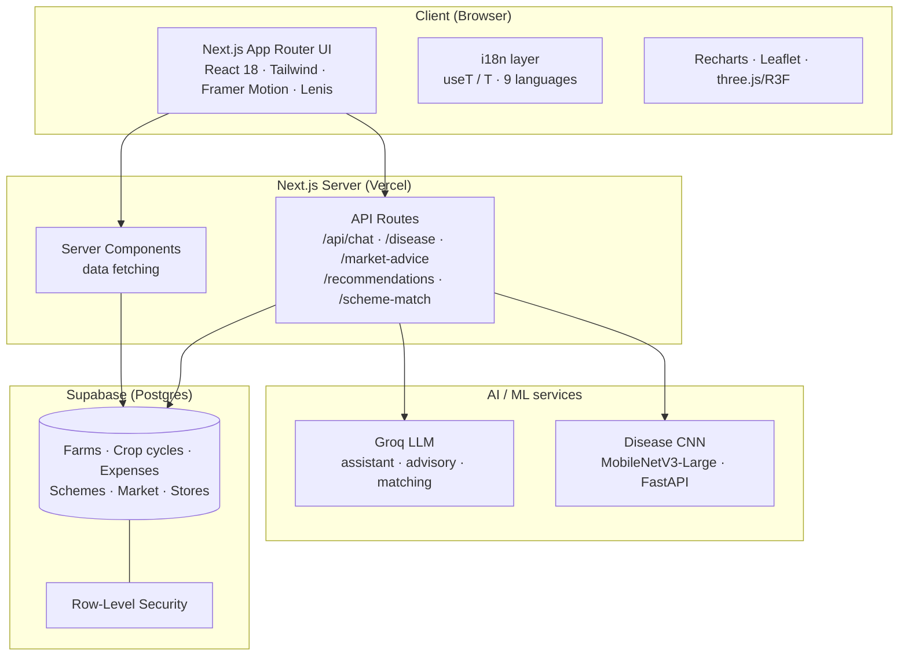

# Agent Farmer × Jaivik Sathi — Technical Document

> **MSME Idea Hackathon 6.0** · Theme: Industry 4.0 & 5.0 · Sector: Agriculture & Allied Industries
> An end-to-end, AI-native agricultural platform — a farmer-facing operating system, plus **Jaivik Sathi** (*जैविक साथी*, "A Companion of the Soil"), a solar-powered on-farm bio-input production and farm-intelligence concept.

---

## Table of contents
1. [Executive summary](#1-executive-summary)
2. [The problem](#2-the-problem)
3. [The solution](#3-the-solution)
4. [System architecture](#4-system-architecture)
5. [Technology stack](#5-technology-stack)
6. [Frontend architecture](#6-frontend-architecture)
7. [The Jaivik Sathi experience page](#7-the-jaivik-sathi-experience-page)
8. [Backend & data layer](#8-backend--data-layer)
9. [AI & machine learning](#9-ai--machine-learning)
10. [The Jaivik Sathi concept (the physical unit)](#10-the-jaivik-sathi-concept-the-physical-unit)
11. [Development journey & engineering challenges](#11-development-journey--engineering-challenges)
12. [Deployment & DevOps](#12-deployment--devops)
13. [Security & privacy](#13-security--privacy)
14. [Project structure](#14-project-structure)
15. [Team](#15-team)
16. [Roadmap](#16-roadmap)
17. [Appendix](#17-appendix)

---

## 1. Executive summary

**Agent Farmer** is an autonomous farming operating system: an AI companion that helps a farmer detect crop disease from a photo, ask questions in their own language, track expenses and market prices, discover government schemes, and turn field data into decisions — **in nine Indian languages**.

**Jaivik Sathi** is the forward-looking ("Future Us") pillar: a **solar-powered, sensor-instrumented on-farm unit** that converts crop residue, dung and village organic waste into **graded compost, vermicompost and liquid bio-inputs** under continuous IoT monitoring, with an AI advisory layer on top — turning a farm from an input *buyer* into an input *producer*.

The deliverable in this repository is the full **software platform** (a production-grade Next.js application, an AI/ML disease pipeline, and a cinematic concept experience for Jaivik Sathi) plus the **concept design** for the physical unit.

---

## 2. The problem

Indian agriculture faces several compounding problems the project targets:

- **Advisory gap** — smallholders lack timely, trustworthy, *local-language* agronomic guidance. Generic advice and language barriers reduce adoption.
- **Late disease detection** — crop disease is often identified too late; expert diagnosis is not accessible at the field.
- **Input cost & residue waste** — farms *buy* fertiliser while simultaneously *burning* crop residue, wasting organic matter and polluting the air.
- **Fragmented information** — weather, mandi prices, schemes, and farm records live in separate silos, none of them decision-ready.
- **Trust & verification** — outcomes (soil health, carbon, quality) are asserted, not *measured*.

## 3. The solution

The platform is built as **two complementary pillars**:

### Pillar A — Agent Farmer OS (built software)
A web application with two faces:
- **Public site** — landing, about, team, architecture, and the Jaivik Sathi concept page.
- **Farmer dashboard** — crops, an AI assistant, an image-based disease scanner, market prices, government-scheme matching, expense tracking, and a store locator.

### Pillar B — Jaivik Sathi (concept + experience)
- The **physical unit** concept (Section 10): production line + IoT sensing + AI advisory + batch traceability.
- A **cinematic web experience** (Section 7) that presents the concept to partners/investors ("Future Us").

---

## 4. System architecture



**Request patterns**
- **Marketing pages** are fully client-rendered (`"use client"`), styled with the public design system.
- **Dashboard pages** are **server components** that fetch data (Supabase) and delegate interactivity to client widgets.
- **API routes** are thin server handlers that call Supabase, Groq, or the ML inference server.

## 5. Technology stack

| Layer | Technology | Why |
|---|---|---|
| Framework | **Next.js 14** (App Router), **React 18**, **TypeScript** | Hybrid server/client rendering, file-based routing, first-class Vercel deploy |
| Styling | **Tailwind CSS** | Utility-first, custom multi-theme token sets |
| Motion / 3D | **Framer Motion**, **Lenis** (smooth scroll), **three.js + react-three-fiber + drei** | Scroll-choreographed, cinematic UX |
| Data viz | **Recharts** | In-app charts (dashboard + concept page) |
| Maps | **Leaflet / react-leaflet** | Store locator |
| Backend | **Supabase** (Postgres, Auth, RLS) + Next.js API routes | Managed Postgres, auth, security policies |
| LLM | **Groq** | Fast inference for the assistant & advisory |
| Vision ML | **PyTorch / torchvision** (MobileNetV3-Large) + **FastAPI** | Efficient on-edge disease classification |
| Deploy | **GitHub** + **Vercel** | Git-driven CI/CD; ML server hosted separately |

## 6. Frontend architecture

### 6.1 App Router structure
Routes live under `src/app/`:
- **Public:** `/` (home), `/about`, `/team`, `/architecture`, `/onboarding`, `/jaivik-sathi`
- **Dashboard:** `/dashboard` and children — `crops`, `assistant`, `disease`, `market`, `schemes`, `expenses`, `settings`, `store-locator`
- **API:** `/api/chat`, `/api/disease`, `/api/market-advice`, `/api/recommendations`, `/api/scheme-match`

### 6.2 Design systems
The app deliberately runs **multiple, scoped design languages** rather than one flat theme:
- **`of-*`** — the light, modern "Agent Farmer OS" palette used by the landing/marketing pages (emerald / forest / blue / slate), with a layered background system (gradient wash, **topographic contour lines**, dot-grid, grain, and slow drifting colour glows).
- **`af-*`** — the light "app" theme for the farmer dashboard.
- **Arva** — an editorial pastoral token set for select pages.
- **Jaivik Sathi** — a self-contained **forest-green cinematic** theme (see Section 7), isolated from the above.

### 6.3 Internationalization (9 languages)
- Languages: **English, Hindi, Kannada, Tamil, Telugu, Malayalam, Marathi, Bengali, Punjabi**.
- Implemented with a lightweight context provider (`LanguageProvider`) exposing a `useT()` hook and an inline `<T>` component; strings are keyed dictionaries (`src/lib/i18n/`), persisted to `localStorage` + cookie.
- Any client tree using translations is wrapped in `<LanguageProvider>`.

### 6.4 Motion & 3D
- **Lenis** provides site-wide weighted, inertial smooth scrolling (with `prefers-reduced-motion` fallback and smooth in-page anchor jumps).
- **Framer Motion** drives scroll-reveals and parallax.
- **three.js / react-three-fiber** power 3D scenes (e.g. the architecture page's node-graph dolly; an experimental farm diorama).

## 7. The Jaivik Sathi experience page

`/jaivik-sathi` is the flagship marketing surface — a **cinematic, forest-green editorial page** built to present the concept at an award-tier level of craft. Reached from the home page's **"Future Us"** call-to-action.

**Design language**
- Palette: canvas `#0F1F10`, text `#F5F4F2`, light-green accent `#c9e87d`.
- Type: **Geist** (grotesque display) + monospace technical labels.
- Motif: a *"measured living world"* — photoreal nature imagery overlaid with scientific-style data annotations and hotspots.

**Section journey**
1. **Hero** — a floating mossy rock (image) with satellites, a targeting reticle + data chip, monospace metric annotations.
2. **Concept** — a statement over a full-bleed soil macro with green crosshair **hotspots**.
3. **What it produces** — image-led product cards (compost / vermicompost / liquid bio-inputs).
4. **Process** — the six-step "waste in, worth out" flow.
5. **The machine** — the solar composting unit, floated on the forest-green void.
6. **Measured. Not estimated.** — a misty-field section with a **frosted-glass data card (live Recharts line chart)** and a click-to-expand numbered capability list.
7. **Community band** — the anchor model ("bought by one farm, shared by many").
8. **Light color-flip** — a bold green→white section with scattered "bento" image tiles + accent data cards.
9. **Impact** + a stat band, then a **giant-wordmark footer** over dark moss.

**Motion**: Lenis smooth scroll; scroll **parallax** on the hero rocks, the floating unit, the section backgrounds, and the bento tiles; CSS-driven hero entrance (see Section 11 for why).

**Assets**: nature/product imagery was **AI-generated** to a consistent art-direction spec (deep forest-green, photoreal, soft light); the model files are the team's; an earlier CC0 3D rock (Poly Haven) was used before switching to imagery.

## 8. Backend & data layer

### 8.1 Supabase (Postgres)
- Domains modelled in `src/lib/`: **dashboard** (farms + crop cycles), **expenses**, **market**, **schemes**, **stores**, **weather**, **disease**, and chat context.
- The client is created in `src/lib/supabase.ts` from environment variables; the browser only ever sees the **anon** key.
- **Row-Level Security (RLS)** governs access; grants/policies are managed via SQL migrations.

### 8.2 Migrations
- `scripts/db-exec.mjs` runs SQL against the project (using an admin access token kept in `.env.admin.local`).
- Versioned SQL lives in `scripts/sql/` (e.g. `001_fix_grants_and_rls.sql`, `002_extend_expenses.sql`).

### 8.3 API routes (server handlers)
| Route | Responsibility |
|---|---|
| `/api/chat` | LLM assistant conversation |
| `/api/disease` | Disease advisory (image result → treatment guidance) |
| `/api/recommendations` | AI crop recommendations |
| `/api/market-advice` | Buy/sell guidance from mandi data |
| `/api/scheme-match` | Match farmer profile → government schemes |

## 9. AI & machine learning

The platform uses a **hybrid** approach — a specialised vision model for detection, and an LLM for reasoning and language.

### 9.1 Crop-disease vision model
- **Model:** MobileNetV3-Large (PyTorch / torchvision) via transfer learning — chosen for a strong accuracy-to-size ratio suitable for edge/low-resource inference.
- **Training:** `ml/train.py` (dataset under `ml/data/`, weights under `ml/models/`).
- **Serving:** `ml/server.py` — a **FastAPI** app (uvicorn) exposing an image-classification endpoint with CORS, image transforms, and softmax confidence. The Next.js app calls it via `INFERENCE_URL`.

### 9.2 Groq LLM layer
- The LLM (via `src/lib/gemini.ts`, using `GROQ_API_KEY`) powers the assistant, disease advisory text, market advice, and scheme matching.
- It is language-aware — responses can be produced in the user's selected Indian language.

### 9.3 The pipeline
`Photo → MobileNetV3 (disease + confidence) → Groq (localised treatment advice) → farmer`.

## 10. The Jaivik Sathi concept (the physical unit)

Jaivik Sathi turns an ordinary holding into a **Udyam-registrable bio-input producer**. The concept unit combines three subsystems:

**A. Production line** — a biomass shredder, an insulated in-vessel composting chamber (auto-turning + forced aeration), HDPE vermibeds, instrumented bioreactors for liquid inputs (**jeevamrutha**, **panchagavya**), and a sieving/bagging station. Outputs (illustrative): **~40 t compost**, **~15 t vermicompost**, **~10,000 L liquid bio-inputs** per year; ~500 kg processed/day.

**B. Sensing & connectivity (Industry 4.0/5.0)** — soil probes, a weather station, compost-chamber probes (temperature, moisture, O₂/CO₂, NH₃), leaf-wetness and water-quality nodes, and imaging poles, all linked over a **solar LoRaWAN gateway (~3 km reach)**. Neighbouring smallholders join the sensing network with a low-cost node.

**C. Intelligence & traceability** — the farm's own data feeds an **AI advisory** layer, and every batch carries a record for **quality and certification** evidence.

**The anchor model** — one farm buys and runs the unit; a large share of output returns to its own land (displacing purchased fertiliser), and the surplus + advisory serve **25–50 surrounding smallholders**. Social impact is delivered *through* the anchor farmer.

> Detailed economics, feedstock/throughput modelling, subsidy stacking, regulatory dependencies, and the risk register live in the separate internal concept document (intentionally **not** committed to the repository).

## 11. Development journey & engineering challenges

This is the "from scratch" story — how the platform came together and the real engineering problems solved along the way.

**Phase 1 — Foundation.** Bootstrapped a Next.js 14 App Router app; established the multi-theme Tailwind token system (`of-*`, `af-*`, Arva), the reusable UI kit, and the 9-language i18n system (`useT`/`<T>`).

**Phase 2 — Product surfaces.** Built the landing site, the farmer dashboard (crops, assistant, disease, market, schemes, expenses, store locator), and wired Supabase + the Groq assistant and the MobileNetV3 disease pipeline.

**Phase 3 — Depth & polish on the public site.** Added a **layered background system** to the flat landing (gradient wash + **topographic contour lines** + grain + slow drifting glow orbs) for depth without distraction.

**Phase 4 — The Jaivik Sathi experience.** Iterated the concept page from a first dark-cinematic draft to a **full, award-tier redesign** inspired by a reference aesthetic — rebuilt originally with the team's own imagery and content.

**Key engineering challenges & solutions**

| Challenge | Root cause | Solution |
|---|---|---|
| Hero headline froze at ~14% opacity | A continuous WebGL render loop **starved** Framer Motion's main-thread animations | Drove above-the-fold entrances with **CSS animations** (compositor-driven) and **paused the canvas offscreen**; later replaced WebGL with an image for the hero |
| Route intermittently 404'd | Fonts loaded via CSS `@import` made the dev compiler fetch remote stylesheets at build time (flaky) | Loaded fonts via `<link>` tags instead (browser-time) |
| Smooth scroll not engaging | Passing both `lerp` **and** `duration` to Lenis (mutually exclusive) | Used `lerp` only |
| Recurring dev `.next` corruption on Windows | Heavy recompiles corrupt the font-manifest / chunks | Clean rebuild (`rm -rf .next`) + restart |
| Production build failed | Pre-existing TypeScript errors in dashboard/3D code + a couple of prop typings | Fixed types properly (optional `created_at`, `Array.from(Set)`, R3F props, `style` prop forwarding) and removed dead 3D code |

**Asset pipeline.** Nature/product imagery was produced from a documented, consistent **art-direction prompt spec** (deep forest-green, photoreal, soft diffused light, shallow depth of field), keeping the whole page visually coherent.

## 12. Deployment & DevOps

- **Source control:** GitHub (`vanoopkumar261-star/agent-farmer`, private). Single `main` branch, Claude Code as co-author on commits.
- **Hosting:** **Vercel** (auto-detects Next.js). The Vercel GitHub App must be granted access to the private repo, then the project is imported and env vars are set.
- **Environment variables** (set in Vercel, never committed): `NEXT_PUBLIC_SUPABASE_URL`, `NEXT_PUBLIC_SUPABASE_ANON_KEY`, `SUPABASE_SERVICE_ROLE_KEY`, `GROQ_API_KEY`, and optionally `INFERENCE_URL`.
- **ML server caveat:** the FastAPI/PyTorch disease server **cannot** run on Vercel (serverless Node). It is hosted separately (e.g. Render/Railway/VM) and `INFERENCE_URL` points to it; all other features run on Vercel.
- **Build verified:** `next build` compiles all routes cleanly (static + dynamic) after the type fixes.

## 13. Security & privacy

- **Secrets** live only in gitignored env files (`.env.local`, `.env.admin.local`); a redacted **`.env.example`** documents the variable *names*. No secrets are committed — verified by a repository scan.
- **Client exposure** is limited to `NEXT_PUBLIC_*` values (Supabase URL + anon key). The service-role key and admin tokens are server-only.
- **Database** access is constrained by **Row-Level Security**.
- **Internal strategy documents** (full economics/risk) are intentionally excluded from the repository.

## 14. Project structure

```
agent-farmer/
├─ src/
│  ├─ app/
│  │  ├─ page.tsx                 # Home (landing)
│  │  ├─ jaivik-sathi/            # "Future Us" concept experience
│  │  ├─ about, team, architecture, onboarding/
│  │  ├─ dashboard/               # Farmer app (crops, assistant, disease, …)
│  │  └─ api/                     # chat · disease · market-advice · recommendations · scheme-match
│  ├─ components/                 # UI kit, dashboard widgets, landing, i18n, three/
│  └─ lib/                        # supabase, gemini(Groq), disease, dashboard, market, schemes, stores, weather, i18n/
├─ ml/                            # MobileNetV3 disease model (train.py) + FastAPI server (server.py)
├─ public/                        # images, team photos, videos, generated assets
├─ scripts/                       # db-exec.mjs + SQL migrations
├─ docs/                          # this document
├─ .env.example                   # required env var names (no secrets)
└─ README.md
```

## 15. Team

| Member | Role |
|---|---|
| **Anoopkumar V** | Team Lead · LLM Developer & 3-D Designer |
| **Barsha Sharma** | Content Researcher & Tester |
| **Sahajtha Singh** | UI Designer & Curator |
| **Shiven Chopra** | i18n Architect & Designer |
| **Manan Agrawal** | Database Manager & Backend Developer |

## 16. Roadmap

- **Hardware pilot** — instrument a reference anchor farm; stream live sensor data into the dashboard.
- **Batch traceability & certification** — QR-tagged batches with sensor-backed provenance.
- **On-device disease inference** — ship the MobileNetV3 model to run offline in low-connectivity fields.
- **Deepen advisory** — feedstock/throughput optimisation and season planning from the farm's own data.
- **Marketplace** — surplus bio-inputs between the anchor and its smallholder network.

## 17. Appendix

### Environment variables
See [`.env.example`](../.env.example). Summary:

| Variable | Scope | Purpose |
|---|---|---|
| `NEXT_PUBLIC_SUPABASE_URL` / `NEXT_PUBLIC_SUPABASE_ANON_KEY` | client | Supabase project + public key |
| `SUPABASE_SERVICE_ROLE_KEY` | server | Full DB access (secret) |
| `GROQ_API_KEY` | server | LLM assistant & advisory |
| `INFERENCE_URL` | server | Disease inference server (optional) |
| `SUPABASE_ACCESS_TOKEN` / `SUPABASE_PROJECT_REF` | admin | DB migrations (`scripts/db-exec.mjs`) |

### Concept figures (illustrative)
~40 t compost · ~15 t vermicompost · ~10,000 L liquid bio-inputs per year · ~500 kg/day throughput · 1 unit serving 25–50 farms · ~3 km LoRaWAN reach · 100% solar-first.

---

*Agent Farmer × Jaivik Sathi — MSME Idea Hackathon 6.0. Built by Team Future Us.*
